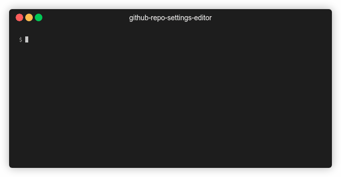

# github-repo-settings-editor

Tired of having to update all the repositories you own to set how you want merges done or enable features like auto-merge?

Me too! That's why I created `grse` (pronounced 'grease'), the command-line tool that:

1. asks you how you like your settings
2. scans all your GitHub repos
3. reports any non-compliant repos
4. updates your repos to your preferred settings



## Install

```
npm i -g github-repo-settings-editor
```

## Usage

```
grse
```

## Limits

Due to rate limits on the [REST](https://docs.github.com/en/rest/overview/resources-in-the-rest-api#rate-limiting) and [GraphQL](https://docs.github.com/en/graphql/overview/resource-limitations#rate-limit) APIs, each hour you are limited to validating 499900 repositories and updating 5000 repositories (15000 if you're a Github Enterprise Cloud user).

## Contributing

1. Clone the [GitHub repository](https://github.com/domdomegg/github-repo-settings-editor)
2. Install [Node.js](https://nodejs.org/en/download/)
3. Run `npm install` (to install dependencies)
4. Run `npm run build` (to build)
5. RUn `npm start` (to run)

Make edits to the code, then re-run steps 4 and 5 to see your changes.
